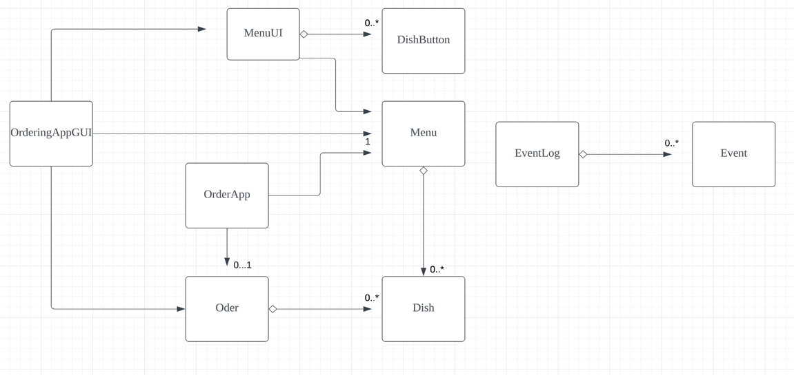

# My Personal Project

## Project description 

What will the application do?

This application is an online ordering system for restaurants.
It allows customers to order takeaway or dine in remotely.
Basically, customers can preorder the food they want via this application even
though they are not physically in the restaurant

Who will use it?
Customers can use this to preview the menu，
to let them view the menu,
select & select the food they want, and output the bill of that order. 

Why is this project of interest to you?
This builds a practical preorder system that could be used in the real life,
which motivates me.

X : the dish 
Y:  the order that customer made.

Basically, customers can preorder the food they want via this application even though they are not physically in the restaurant
This builds a practical pre-ordering system that could be used in the real life, which motivates me. 

## User Stories
- As a user, I want to see the picture of the dish. 
- As a user, I want to see the ingredients of the dish (allergy issue)
- As a user, I want to select the food I want, and save it. 
- As a user, I want to delete the dish I don't want.
- As a user, I want to restart my order whenever I like 
- As a user, I want to know the total amount of money the food I picked would cost.
- As a user, I want to save my current order when quiting the app
- As a user, I want to load my previous order from a file 

## Instructions for Grader
- You can add the dish to an order by clicking the image of Dish, then click "add the dish" button
- You can remove the dish from an order by clicking the image of Dish, then click "remove the dish" button
- You can restart order by clicking "redo order" button of Menu Main Frame.
- You can check total amount of money of order by  clicking "view bill" button of Menu Main Frame. 
- You can locate my visual component by the images for each dish in Menu Main Frame. 
- You can save the state of my application by clicking "Save current order" button of Menu Main Frame.
- You can reload the state of my application by clicking "load previous order" button of Menu Main Frame. 

## Citation: 
- Classes and corresponded test in persistence file refers to the demo project
  - the link to github: https://github.students.cs.ubc.ca/CPSC210/JsonSerializationDemo
- Load and Save method refers to WorkRoom project
  - the link to github: https://github.students.cs.ubc.ca/CPSC210/JsonSerializationDemo

## Phase 4: Task 2

Mon Apr 03 11:05:00 PDT 2023
Dish: Aussie Sliced Lamb Shoulderis added to order

Mon Apr 03 11:05:02 PDT 2023
Dish: Sliced US Beefis added to order

Mon Apr 03 11:05:04 PDT 2023
Dish: Signature Beefis added to order

Mon Apr 03 11:05:06 PDT 2023
Dish: Cilantrois added to order

Mon Apr 03 11:05:08 PDT 2023
Dish: Cilantrois removed from order

Mon Apr 03 11:05:11 PDT 2023
Dish: Pork Stomach and Chicken Soupis added to order

## Phase  4: Task 3

