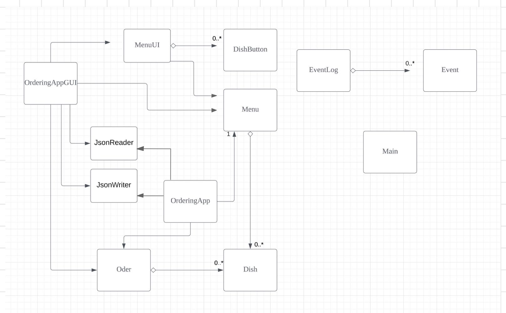

# My Personal Project

## Project description 

What will the application do?  
This application is an online ordering system for restaurants.
It allows customers to order takeaway or dine in remotely.
Basically, customers can preorder the food they want via this application even
though they are not physically in the restaurant

Who will use it?  
Customers can use this to preview the menu，
to let them view the menu,
select & select the food they want, and output the bill of that order. 

Why is this project of interest to you?  
This builds a practical preorder system that could be used in the real life,
which motivates me.

X : the dish 
Y:  the order that customer made.

Basically, customers can preorder the food they want via this application even though they are not physically in the restaurant
This builds a practical pre-ordering system that could be used in the real life, which motivates me. 

## User Stories
- As a user, I want to see the picture of the dish. 
- As a user, I want to see the ingredients of the dish (allergy issue)
- As a user, I want to select the food I want, and save it. 
- As a user, I want to delete the dish I don't want.
- As a user, I want to restart my order whenever I like 
- As a user, I want to know the total amount of money the food I picked would cost.
- As a user, I want to save my current order when quiting the app
- As a user, I want to load my previous order from a file 

## Instructions for Grader
There is a log-in frame, once you input the username, the menu frame will show up, then

- You can add the dish to order by clicking the image of the Dish, then clicking the "add the dish" button
- You can remove the dish from an order by clicking the image of the Dish, then clicking the "remove the dish" button
- You can restart the order by clicking the "redo order" button of the Menu Main Frame.
- You can check the total amount of money in order by clicking "view bill" button of the Menu Main Frame.
- You can locate my visual component by the images for each dish in Menu Main Frame.
- You can save the state of my application by clicking the "Save current order" button of the Menu Main Frame.
- You can reload the state of my application by clicking the "load previous order" button of the Menu Main Frame.
## Citation: 
- Classes and corresponded test in persistence file refers to the demo project
  - the link to github: https://github.students.cs.ubc.ca/CPSC210/JsonSerializationDemo
- Load and Save method refers to WorkRoom project
  - the link to github: https://github.students.cs.ubc.ca/CPSC210/JsonSerializationDemo
- Event class and Eventlog Class refers to Alarm System application
  - the link to gitHub: https://github.students.cs.ubc.ca/CPSC210/AlarmSystem.git

## Phase 4: Task 2

Wed Apr 05 14:08:49 PDT 2023  
Dish: Sliced US Beef is added to order

Wed Apr 05 14:08:55 PDT 2023  
Dish: Sliced US Beef is added to order

Wed Apr 05 14:08:57 PDT 2023  
Dish: Aussie Sliced Lamb Shoulder is added to order

Wed Apr 05 14:09:00 PDT 2023  
Dish: Cilantro is added to order

Wed Apr 05 14:09:04 PDT 2023  
Order is cleaned

Wed Apr 05 14:09:06 PDT 2023  
Dish: Iceberg Lettuce is added to order

## Phase  4: Task 3

### Refactor idea
First, The OrderingAppGUI can be restructured by extracting setMenuFrame() from login() method and calling setMenuFrame() from the constructor rather than being a part of login() because setting Menus Frame is a part of Initializing process of the application rather than doing functionality of login. If we extract setMenuFrame() this way, the code is more readable and reflects the behavior of what is going on.

Second, by looking at UML, we can observe that OrderingApp, OrderingAppGUI, and MenuUI have a field for the menu (association of menu). 3 classes are accessing the same Menu Object all the time. There is no modification or change of the menu object once it has been constructed. Also, the meaning of Menu Class is to create a menu for customers who are ordering. Therefore, to clean up the messy code and make code easier, we can make the menu class a singleton class, letting all other classes accessing directly. Since the menu can not change after the ordering process begins, the singleton
field that stores the reference of the menu object can be a public final field. (or private final field)

